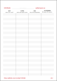

jednoduchý nástroj na boj s nemocí **COVID**-19 - de**ník** setkání

Pravidelným zapisováním si do deníku, s kým jste se setkali, můžete v případě potvrzení nažení nemocí COVID-19 výrazně pomoci hygienikům. Budete vědět, kde jste měli příležitost se nakazit nebo vy nakazit jiného. Možná tím někomu **zachráníte život**. Určitě tím usnadníte ostatním práci.

Osobní zodpovědností a důsledností může každý z nás přispět k nešíření epidemie! Nejen nošením ústenek.

**Zapisujte si jak chcete, kam chcete. Na volný papír, do diáře, kalendáře, poznámek v mobilu.**

Berte však ohled na soukromí ostatních. Váš záznam může jinému ublížit. Určitě záznamy nesdílejte online, nesynchronizujte a nezálohujte do cloudu, nepoužívejte Microsoft Office 365&trade;, Google Docs&trade; a podobné. Bylo by to v rozporu s dobrými mravy i GDPR.

Kdo je chytrej, používá COVIDník - „Hloupou karanténu“, kdo je hloupej, ať použije státní „Chytrou karanténu.“

Vytiskněte si přiložené šablony PDF nebo DOCX, nebo si zapisujte do tabulky.

**Šablony ke stažení:**

|  pro tisk | pro tisk | tabulka pro elektronickou práci |
|:-------------:|:------------------:|:--:|
|  [COVIDník A4.pdf](https://github.com/cernekj/COVIDnik/blob/master/COVIDnik_A4.pdf) [COVIDník A4.docx](https://github.com/cernekj/COVIDnik/blob/master/COVIDnik_A4.docx) |  [COVIDník A5.pdf](https://github.com/cernekj/COVIDnik/blob/master/COVIDnik_A5.pdf) [COVIDník A5.docx](https://github.com/cernekj/COVIDnik/blob/master/COVIDnik_A5.docx)  |  [COVIDník.xlsx](https://github.com/cernekj/COVIDnik/blob/master/COVIDnik_A5.pdf) |

samoy..

## Návod k použití COVIDníku

1. nachystej si místo kam budeš zapisovat: vytiskni si ho, dej do telefonu, nebo jinam, ať je snadno dostupný
2. nachystej si k němu tužku, odstraň všechny bariéry, abys ses mu nevyhýbal
3. zapisuj často, alespoň denně, klidně si nastav budíka
4. udělej z COVIDníku návyk
5. nepřeháněj to s podrobnostma, COVIDník Tě musí bavit
6. COVIDník chraň, proti ztrátě, ale i cizím očím
7. určitě ho nesdílej online, nesynchronizuj a nezálohuj do cloudu
8. ber ohled na soukromí ostatních, Tvůj záznam může jinému ublížit
9. víc jak 14 staré záznamy odstraňuj
10. drž se!, přispíváš řešení problému, Tvá zodpovědnost a důslednost může jiného zachránit
11. díky COVIDníku vidíš svůj sociální život
12. nestyď se a sdílej tento nápad s ostatníma

+. snad ho nebudeš potřebovat, ale když jo, tak doplň kontakty a předej ho hygieně

## Manifest - podporujeme „Hloupou karanténu“

Návrh na COVIDník státní orgány obdrželi 23. 3. 2020, ale asi jim někde zapadl. Vypadá to, že vládnoucí režim přece jenom chce radši totalitně kontrolovat lidi pomocí sledování polohy jejich mobilních zařízení (tzv. Chytrá karanténa). Stejně jako v Izraeli a na Slovensku.

Jako občané jsme zodpovědní, samostatní a chceme být svobodní. Nechceme dohled Velkého bratra. Také proto, že ho nepotřebujeme. Nenecháme sledovat svůj pohyb mobilními telefony a operátory, platebními kartami, jak nám to po dvaceti letech stát a firmy konečně přiznaly.

Soukromí je podmínkou pro to jednat podle vlastního svědomí, nejen plnit nařízení či očekávání jiných. Je to nevyhnutná podmínka osobní svobody, volnosti projevů osobní povahy a inovací. Soukromí nepotřebuje jen ten, kdo nemá co ztratit - život, zdraví, lásku, rodinu, svobodu, majetek, znalosti, ani věci čistě sentimentální hodnoty. Před prolamováním osobní svobody ať se radši prolomí dříve právo na firemní patenty, licence a know-how, potom právo na majetek právnických, potom i fyzický osob. Psychologie i teologie učí, že bez svobody není možná ani láska ke druhému.

## Pomozte

Hledám dobrovolníky, co by připravili mobilní aplikaci pro toto použití. Sám mobilní apky nedělám.

Náčrt specifikace:
- K.I.S.S GUI s dobrým UX/HCI
- šifrované uložení dat - asi sqlite+encryption)
- připomínky - časové nebo například nějakou dobu po ukončení pohybu GPS
- synchronizace dat volitelná na zvolené uložiště - třeba jako má [Joplin.app](https://github.com/laurent22/joplin)
- minimum vyžadovaných práv v OS (žádná kamera atd.)
- volitelně použitelné kontakty, kalendář, GPS, připomínky, síťově připojení jen pro synchronizaci dat - nikam jinam!

## Do and share!
